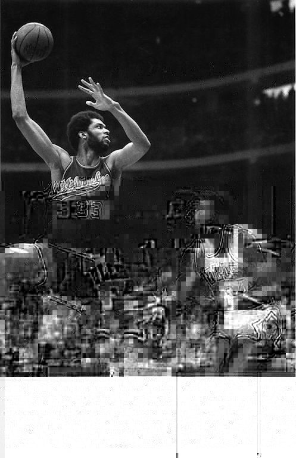
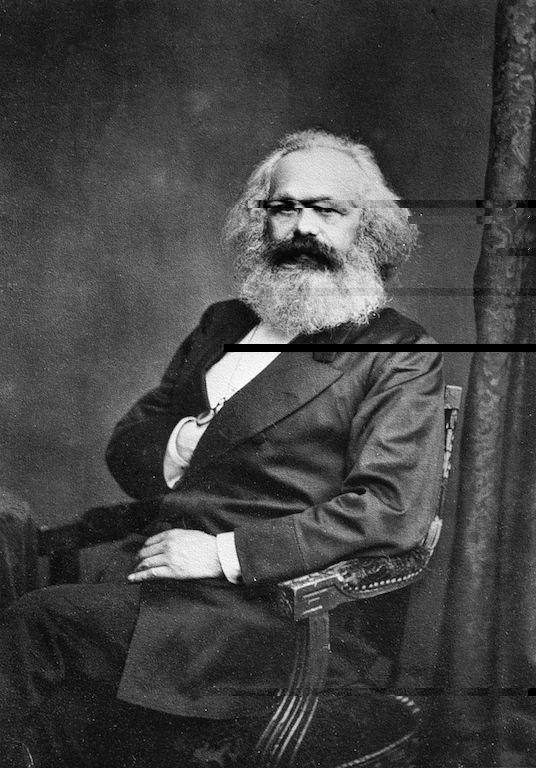
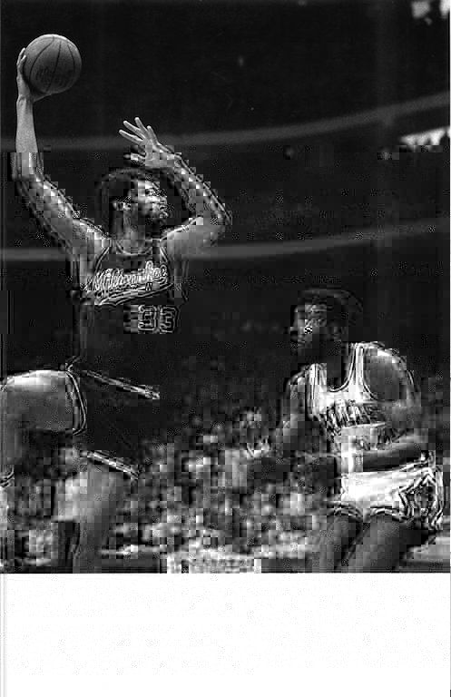

# Glitcher

This app will glitch or distort an image by manipulating bytestrings in one of three ways: replace, rearrange, or delete.

## How to Use

### Single files

`stack build`

`stack exec glitcher-exe <file1.jpg>`

### Multiple files

`stack exec glitcher-exe <file1> ... <fileN>`

## Default behavior

The default app calls each of the three glitch functions once. Users can change this behavior by adding or removing functions into the `imageGlitch` list.

### Transpose

An example of a modified or glitched image, after being run through the `transpose` (re-order) function, can be found below:

### Defect

An example of a modified or glitched image, after being run through the `defect` (delete) function, can be found below:

### Replace

An example of a modified or glitched image, after being run through the `relace` function, can be found below:

## Credit

- A more thorough example of image glitching can be found [here](https://www.manning.com/books/learn-haskell), and the main functionality of this program is taken from that.

- Another image glitcher in Haskell can be found [here](https://github.com/latermuse/glitcher).

- The names and purpose for the functions are taken from the article [here](https://ucnv.github.io/pnglitch/).
